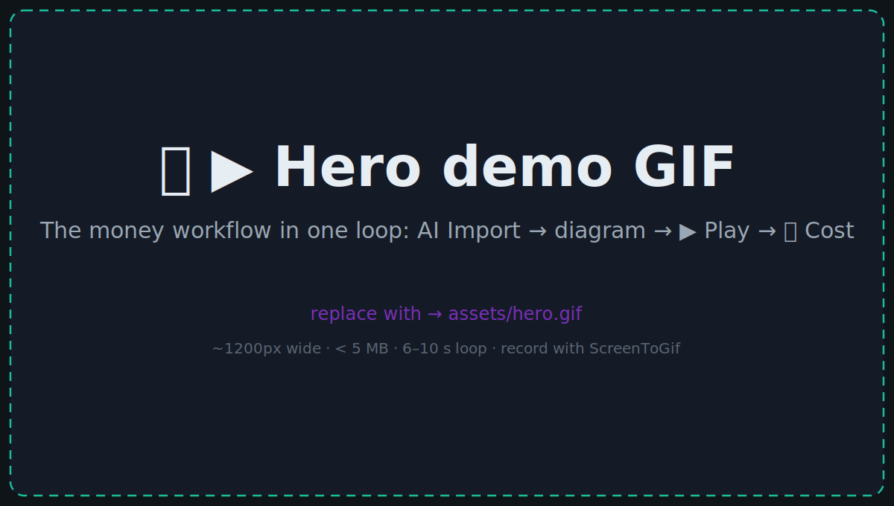
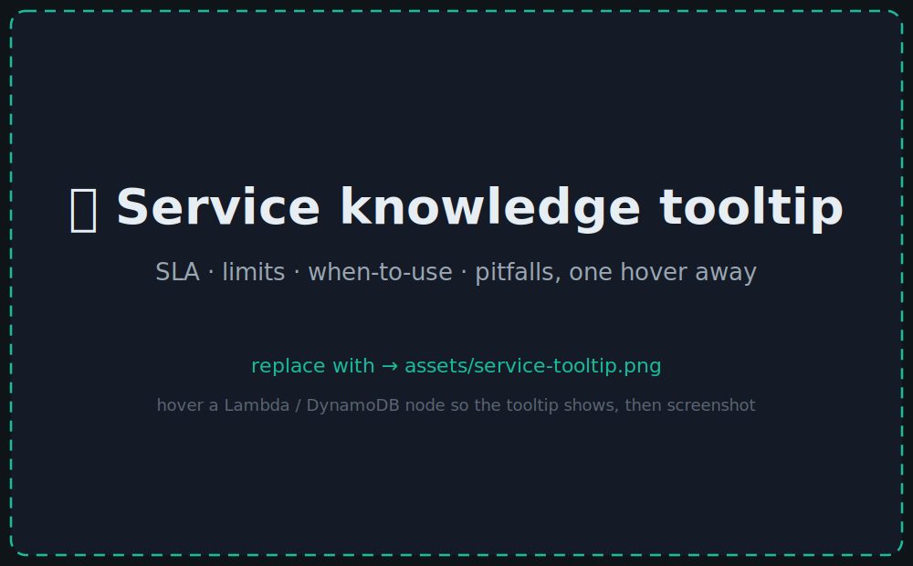
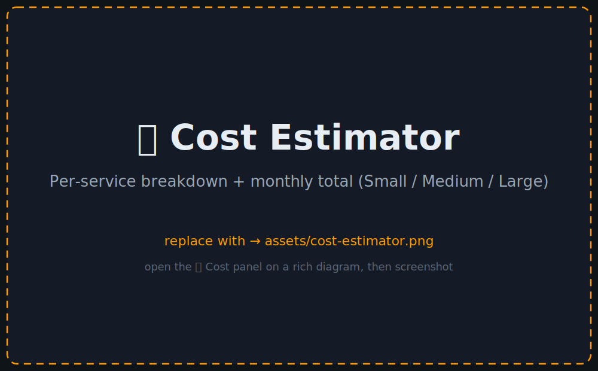
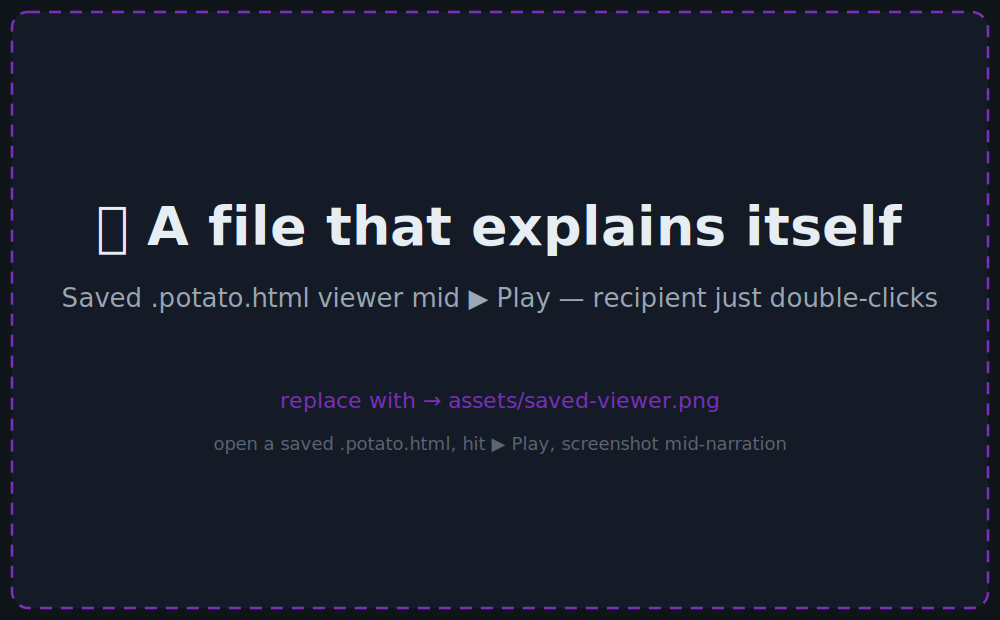

<div align="center">

# 🥔 Potato

### The Cloud Architecture Studio.

**Design AWS / Azure / GCP systems, understand them, price them, and ship a self-contained interactive doc — all in one HTML file.**

*Not a drawing app. Describe your system to any LLM, watch the flow ▶ Play itself, read each service's SLA · limits · pitfalls on hover, total the monthly cost, and ⬇ download the whole workflow as a runbook. No account, no server, no internet.*

[](LICENSE)
[](https://abhisheksingh011.github.io/potato/)
[](#-service-knowledge-base)
[](icons/)
[](#tech-stack)

<br>



</div>

---

## ⚡ Open it now — no install, no account

**👉 [abhisheksingh011.github.io/potato](https://abhisheksingh011.github.io/potato/)**

Just open the link. Nothing to install. Works in any browser.

> **Want it offline?** The entire app is one self-contained HTML file — save it once and it works forever without internet.
>
> ```bash
> git clone https://github.com/abhisheksingh011/potato.git
> # then double-click index.html  — runs from file://, no build step
> ```

---

## 🤖 Need a diagram fast? Let your LLM build it.

1. Open Potato → click **🤖 AI Import** → **Copy LLM prompt**
2. Paste it into any LLM (ChatGPT, Claude, Gemini, Copilot…) and describe your architecture
3. Copy the reply → back in Potato, paste it into **🤖 AI Import** → click **Import**

That's it. A fully-wired, icon-labelled, cost-aware diagram appears in seconds.

---

## 🧠 Why this isn't a diagram tool

A diagram tool stops at the picture. **Potato keeps going** — it's where you *design, understand, price, and document* a cloud system, not just draw one.

> **The picture is the cheap part.** The value is everything Potato wraps around it: the operational knowledge baked into every node, the animated walkthrough, the downloadable runbook, and the monthly cost. A box labelled "Lambda" is a drawing. A Lambda node that tells you its 15-minute ceiling, its cold-start pitfall, its SLA, and its monthly cost — and narrates how a request flows through it — is architecture intelligence.

If you're choosing Potato, you're not choosing it *over* draw.io. You're choosing a different category.

---

## 🎯 What you get beyond the diagram

| | |
|---|---|
| 📋 **Architecture knowledge, built in** | Every AWS / Azure / GCP node carries real **SLA, limits, when-to-use guidance, and common pitfalls** — Lambda's 15-min cap, DynamoDB's 400 KB item limit, RDS connection ceilings — one hover away. 52 services documented. |
| 💰 **Monthly cost estimator** | Hover for pricing formulas; click `💰 Cost` to total the whole design at Small / Medium / Large workloads, with a per-service breakdown and a coverage indicator. |
| ▶ **Play-the-flow sequences** | Hit ▶ Play and the architecture **explains itself** step-by-step, with detailed narration that ships inside the file — request lifecycle, failure branches, scheduled jobs, end to end. |
| ⬇ **Downloadable workflow runbook** | Export the play-flow as a numbered **plain-text runbook** (`.txt`) — drop it straight into your docs, a PR description, or an onboarding wiki. The diagram becomes documentation. |
| 🤖 **Plain-English → architecture** | Paste the [Potato prompt](POTATO_LLM_PROMPT.md) into any LLM (ChatGPT / Claude / Gemini / Copilot), describe your system, paste the reply back. Get a real, editable, *knowledge-enriched* design — not just shapes. |
| 📤 **A file that explains itself** | Save → email → recipient double-clicks → interactive viewer in any browser. They hover tooltips, ▶ Play the flow, see the costs. No Potato, no account, no install. |
| 🪣 **1067 official cloud icons** | AWS / Azure / GCP, searchable, drag-and-drop — the real artwork the vendors ship, not stylised reproductions. |

> No account. No telemetry. No subscription. No internet after the initial download.

---

## 🎬 The headline workflow

```text
┌──────────────────────────────────────────────────────────────────────┐
│  1. Describe your system to any LLM (paste the Potato prompt)         │
│  2. Paste the reply into 🤖 AI Import → a real architecture appears   │
│  3. Hover nodes → SLA · limits · pitfalls.  Click 💰 → monthly cost   │
│  4. Hit ▶ Play → the flow narrates itself, step by step               │
│  5. ⬇ Download the workflow as a text runbook for your docs/PR        │
│  6. 💾 Save → a self-contained .potato.html that explains itself      │
└──────────────────────────────────────────────────────────────────────┘
```

**A real prompt that works**:

> *"Show a RAG chatbot on AWS: S3 docs → embedding Lambda → OpenSearch vector index → API Gateway → Bedrock with Claude. Add CloudWatch on each Lambda."*

What comes back isn't just a picture: real AWS-iconed nodes color-themed by service family, each carrying its SLA / limits / pitfalls, a `playFlow` narration that walks the request lifecycle end-to-end, a cost panel ready to total, and a runbook one click from export.

---

## 🆚 Drawing tools draw. Potato does the other 80%.

Everyone can draw a box. The table below is deliberately *not* about drawing — it's about what happens **after** the boxes are on the canvas. That's the gap Potato fills, and it's why a head-to-head "which diagram tool" comparison misses the point.

| | **Potato** | draw.io | Excalidraw | Mermaid | Lucidchart |
|---|---|---|---|---|---|
| **Service knowledge** (SLA · limits · pitfalls) on every node | ✅ | ❌ | ❌ | ❌ | ❌ |
| **Monthly cost estimator** | ✅ | ❌ | ❌ | ❌ | ❌ |
| **Play-the-flow** animated walkthrough with narration | ✅ | ❌ | ❌ | ❌ | ❌ |
| **Downloadable text runbook** from the flow | ✅ | ❌ | ❌ | ❌ | ❌ |
| **LLM-native** — describe it in English, any model | ✅ | ❌ | ❌ | ⚠️ syntax | ❌ |
| **Self-explaining shareable file** (recipient interacts) | ✅ | ❌ | ❌ | ❌ | ❌ |
| 1067 official AWS/Azure/GCP icons built-in | ✅ | ⚠️ download | ❌ | ❌ | ✅ paid |
| Single offline HTML file | ✅ | ❌ | ❌ | ❌ | ❌ |
| Lives in `git diff` next to your code | ✅ HTML | ⚠️ XML | ⚠️ JSON | ✅ MD | ❌ |
| Account / login required | ❌ | ❌ | ❌ | ❌ | ✅ |
| Pricing | **Free** | Free | Free | Free | $$$ |

The first six rows are the product. The drawing is table stakes.

---

## 📸 See it in action

<table>
<tr>
<td width="50%" align="center">
<br>
<b>📋 Knowledge on every node</b><br><sub>SLA · limits · when-to-use · pitfalls, one hover away</sub>
</td>
<td width="50%" align="center">
<br>
<b>💰 Monthly cost, totalled</b><br><sub>Per-service breakdown at Small / Medium / Large</sub>
</td>
</tr>
<tr>
<td width="50%" align="center">
<br>
<b>📤 A file that explains itself</b><br><sub>Recipient double-clicks → hovers, ▶ Plays, sees cost</sub>
</td>
<td width="50%" align="center">
<br>
<b>🤖 → ▶ → 💰 → ⬇</b><br><sub>Describe it, Play it, price it, download the runbook</sub>
</td>
</tr>
</table>

> Screenshots are placeholders right now — see [`assets/README.md`](assets/README.md) to drop in real captures (the layout updates automatically).

---

## 📚 12 templates to start from

Open `✨ Templates` in the toolbar and pick:

**AWS architectures**

| Template | What you get |
|---|---|
| **AWS Three-Tier Web App** | Route 53 → CloudFront → WAF → ALB → ECS Fargate (2 AZs) → Aurora + ElastiCache |
| **AWS Serverless API** | API GW → Cognito → Lambda → DynamoDB + SQS async worker + X-Ray |
| **AWS Event-Driven Microservices** | API GW → Lambda services → EventBridge → SQS fan-out → Lambda consumers |
| **AWS Static Site + CDN** | S3 → CloudFront → WAF + ACM + Lambda@Edge → Route 53 |
| **AWS Data Lake & Analytics** | S3 raw → Glue ETL → S3 curated → Athena + Redshift → QuickSight |
| **AWS Container Platform** | CodeCommit → CodePipeline → ECR → ECS Fargate → ALB → Aurora |
| **AWS Hub-and-Spoke Network** | Direct Connect + VPN → Transit Gateway → Prod/Shared/Dev VPCs + Network Firewall |

**Specialty / cross-cloud**

| Template | What you get |
|---|---|
| **AI Agent Architecture** | Supervisor + sub-agents on Bedrock with memory + tools |
| **ML Training Pipeline** | S3 → SageMaker → Model Registry → real-time + batch inference |
| **RAG Chatbot** | Embedding pipeline + vector DB + Bedrock RAG |
| **Kubernetes App** | Ingress → 2 deployments → Redis + Postgres statefulsets |
| **Multi-Region Active-Active (AWS)** | Two regions live + serving. ECS on Spot, DDB Global Tables, S3 CRR, KMS multi-region keys, ECR replicated. Includes Play Flow narration of one request + failover. |
| **+ your own** | Save any diagram and it shows up under "Recent" |

---

## 🚀 Features at a glance

**Diagramming**
- 1067 real AWS / Azure / GCP icons + emoji shapes
- Orthogonal arrows that route around obstacles
- Animated / dashed / dotted arrow styles, 9 colors
- Groups / swimlanes for VPCs, subnets, service boundaries
- Auto-layout (LR / TB), grid snap, fit-to-content
- Touch + pen support on iPad / tablets
- **Dark + light themes** with visible group borders in both

**AI workflow**
- Inline LLM prompt — one click to copy, no GitHub round-trip
- `🤖 AI Import` validates + sanitizes + rescues icon paths the LLM guessed wrong
- `playFlow` narration ships inside the diagram; ▶ Play walks through it on-screen
- Sequence Editor to reorder, edit, or rewrite the narration — and **⬇ download the whole walkthrough as a text workflow** (`.txt`, numbered steps + narration) for docs, runbooks, or a PR
- Prompt asks the LLM for detailed, walkthrough-style narration — full service names, the trigger/data/why of each hop, and the complete lifecycle end-to-end
- Works with **GitHub Copilot Chat** out of the box — just reference [`POTATO_LLM_PROMPT.md`](POTATO_LLM_PROMPT.md)

**Knowledge**
- Service KB with **SLA, limits, when-to-use, cost formulas, and pitfalls** for 52 services
- Hover or open the Properties panel — same data, with the as-of date footnote
- Quarterly refresh via one JSON file (`service_kb.json`) + a build script

**Cost Estimator** (`💰 Cost` toolbar button)
- Three workload presets (Small / Medium / Large)
- Per-service breakdown grouped by service type, monthly subtotal each
- Auto-sum total with coverage indicator ("14 of 17 services priced")
- Honest about what's not modelled (egress, NAT gateway, support plans)

**Export & share**
- `💾 Save` → self-contained `.potato.html` (~10–60 KB). Reopens in Potato to edit, double-clicks to view standalone.
- The saved-HTML viewer is **interactive** — hover for tooltips, ▶ Play the flow, switch dark/light theme, no editor required.
- `⬇ Download workflow` (in the Sequence Editor) → exports the ordered steps + narration as a plain-text (`.txt`) file, ready to paste into docs or a PR.

**Import**
- AI Import (LLM HTML or raw JSON)
- Mermaid (`flowchart`, `graph`, `sequenceDiagram`)
- Potato JSON

**Quality of life**
- 60-level undo / redo, copy / paste (preserves arrow connections)
- Multi-select, drag-rect, arrow-key nudge, shift-nudge x10
- Auto-save to localStorage + per-tab crash recovery
- Recent diagrams (last 8) in the Templates modal

---

## ⌨️ Keyboard shortcuts

| Shortcut | Action |
|---|---|
| `Ctrl+S` | Save |
| `Ctrl+Z` / `Ctrl+Y` | Undo / Redo |
| `Ctrl+C` / `Ctrl+V` | Copy / Paste (preserves connections) |
| `Ctrl+A` | Select all |
| `Delete` | Delete selected |
| `Space` | ▶ Play / ⏹ stop the flow animation |
| `S` / `H` / `T` / `G` | Select / Pan / Text / Group tool |
| `+` / `-` / `0` / `F` | Zoom in / out / reset / fit |
| `Arrow keys` | Nudge 1 px (Shift = 10 px) |
| `Escape` | Clear selection · stop playback · close modals |

---

## 🧠 Service Knowledge Base

Every cloud node carries five fields you can edit, refresh quarterly, or extend:

```json
{
  "lambda": {
    "name":      "AWS Lambda",
    "sla":       "99.95% monthly uptime",
    "limits":    "Max execution: 15 min | Memory: 128 MB–10 GB | …",
    "whenToUse": "Best for short-lived, event-driven tasks. Scales to zero.",
    "cost":      "$0.20/M requests + $0.0000166/GB-s. Free tier: 1M req…",
    "pitfalls":  ["VPC cold starts add 1–5 s — keep Lambda outside VPC…", "…"]
  }
}
```

Surfaced in:
- Hover tooltip on the canvas
- Properties panel when a node is selected
- Cost Estimator breakdown
- The standalone saved-HTML viewer

Add new entries to [`service_kb.json`](service_kb.json), run `node _generate_kb.js`, commit. That's the entire workflow.

---

## 🤖 AI workflow in detail

1. **Click 🤖 AI Import** — modal walks you through 3 steps.
2. **Step 1**: ▶ Copy the Potato prompt. It explains the JSON schema, the 1067 icon paths, layout rules, theme conventions, and the `playFlow` narration format.
3. **Step 2**: Paste into your LLM (ChatGPT / Claude / Gemini / Copilot / Mistral / Llama / Grok — anything that returns HTML). Describe your architecture in plain English.
4. **Step 3**: Paste the LLM's full HTML reply (or save it as `my-diagram.potato.html` and open via `📂 Open`). Click ⬇️ Import.

Potato will:
- Validate every node, arrow, group, and `playFlow` step
- Rescue mismatched icon paths from the node's `type` field (LLMs guess paths wrong sometimes)
- Show a sanitization toast: *"🔧 3 icon paths didn't match our catalog — rescued from node type."*
- Drop you straight on the editable canvas

The prompt lives in [`POTATO_LLM_PROMPT.md`](POTATO_LLM_PROMPT.md) if you want to read it, fork it, or feed it to Copilot Chat.

### Use Potato from inside GitHub Copilot Chat

In any project, ask Copilot:

```
Read #file:POTATO_LLM_PROMPT.md to learn the Potato format,
then read my code under #file:src/ and produce architecture.potato.html.
```

Copilot writes the file. Double-click it. You have a diagram.

---

## 💾 Save & share

Saved files are real interactive web pages:

- **Hover any service** → tooltip with SLA, limits, when-to-use, cost (with as-of date), common pitfalls.
- **▶ Play Flow** button → animates the request lifecycle with your narration.
- **Speed dropdown** → 🐢 Slow / Normal / 🐇 Fast.
- **🌙 / ☀️ theme toggle** → flips dark/light, persists per viewer.
- **Space to play, Escape to stop** — same shortcuts as the editor.
- **Drop the file back into Potato** to keep editing — full round-trip.

File size: typically 10–60 KB. No external dependencies. Works fully offline. Email-safe.

---

## 🛠 Tech stack

- **Pure vanilla JS** — no React, no Vue, no TypeScript, no build step.
- **HTML5 Canvas** for the minimap.
- **SVG** for the live arrows + saved viewer.
- **CSS Variables** for theming.
- **System fonts** — no Google Fonts, no CDN.
- **localStorage** for autosave; **BroadcastChannel** for cross-tab notifications; **IndexedDB** for FileSystemFileHandle persistence (Chromium).
- **Pointer Events** — works on mouse, trackpad, touch, and pen with identical code paths.

Zero `npm install`, zero compile step, zero runtime dependencies. The whole editor is one ~8700-line HTML file (the bulk is the inlined SVG icon library).

---

## 📁 Project structure

```
potato/
├── index.html                 ← THE entire editor (single file)
├── service_kb.json            ← Quarterly-refresh source of truth for tooltips + cost
├── _generate_kb.js            ← Splices service_kb.json into index.html
├── _generate_components.js    ← Splices the icons/ tree into the COMPONENTS manifest
├── _test_saved_viewer.js      ← Smoke test for the saved-viewer inline script
├── icons/                     ← 1067 SVGs across aws/azure/gcp by category
├── assets/                    ← README screenshots + capture guide
├── POTATO_LLM_PROMPT.md       ← Long-form prompt you can copy into any LLM
├── .github/
│   ├── copilot-instructions.md  ← Auto-loaded by Copilot Chat in this repo
│   └── workflows/check.yml      ← CI: parses inline script, validates JSON, generator drift, viewer smoke test
└── README.md                  ← You are here
```

---

## 🔌 Extend it

**Add custom icons**
1. Drop SVGs into `icons/<provider>/<category>/`.
2. Run `node _generate_components.js`.
3. Reload `index.html`.

**Add cost data for more services**
1. Edit [`service_kb.json`](service_kb.json) — add `costEstimate: { small, medium, large }` to any entry.
2. Run `node _generate_kb.js`.
3. The Cost Estimator picks it up automatically.

---

## 🤝 Contributing

PRs welcome — see [CONTRIBUTING.md](CONTRIBUTING.md).

Especially wanted:
- More services in `service_kb.json` with `costEstimate` fields (39 priced of 52 covered — the 13 unpriced are mostly Azure/GCP/generic shapes)
- Quarterly pricing-refresh PRs
- More templates in the gallery
- Mermaid export (we import; closing the loop is a small lift)
- A GitHub Action that renders `.potato.html` files in PR diffs
- A `potato render diagram.potato.html --png out.png` CLI for CI pipelines

---

## ⚠️ Disclaimers

**Not affiliated with or endorsed by any cloud provider.**
Potato is an independent open-source project. It is not affiliated with, sponsored by, or endorsed by Amazon Web Services, Inc., Microsoft Corporation, or Google LLC.

**Trademark notices.**
Amazon Web Services and the AWS logo are trademarks of Amazon.com, Inc. or its affiliates.
Microsoft Azure and the Azure logo are trademarks of Microsoft Corporation.
Google Cloud and the Google Cloud logo are trademarks of Google LLC.
All cloud service names, icons, and logos appearing in this tool are the property of their respective owners and are used solely to identify those services in technical architecture diagrams. Use of these marks does not imply any relationship with or endorsement by the respective trademark holders. All icon usage is subject to the brand guidelines of the respective provider — see [NOTICE](NOTICE) for details.

**Cost estimates are approximate and may be outdated.**
The built-in cost estimator and the pricing figures in the service knowledge base are editorial summaries of publicly available information, accurate as of the "as of" date shown for each service. Prices change frequently. **Do not use these estimates for budget planning, procurement decisions, or commercial commitments.** Always verify current pricing with the official provider calculators:
- AWS: https://calculator.aws/
- Azure: https://azure.microsoft.com/en-us/pricing/calculator/
- GCP: https://cloud.google.com/products/calculator

**SLA, limits, and service information may be outdated.**
The service knowledge base (SLA values, quota limits, pitfalls) summarises public documentation as of the stated date and may not reflect the current state of each service. Cloud providers update limits, SLAs, and feature availability frequently. Always verify against official provider documentation before making architectural or operational decisions.

**AI-generated diagrams may contain errors.**
Diagrams produced by LLMs via the AI Import feature are machine-generated and may contain hallucinations, incorrect service configurations, wrong icon assignments, or architectures that do not follow best practices. Review every AI-generated diagram carefully before using it in a production design, a cost estimate, or any decision-making context.

**No professional advice.**
Potato is a diagramming and documentation tool. Nothing it produces — diagrams, cost estimates, SLA summaries, playFlow narrations, or runbooks — constitutes professional engineering, legal, financial, or security advice. Consult qualified professionals for architecture reviews, compliance requirements, and procurement decisions.

**"As-is" warranty disclaimer.**
Potato is provided under the MIT License "as is", without warranty of any kind. See [LICENSE](LICENSE) for the full disclaimer. The maintainers are not liable for errors, omissions, or decisions made in reliance on content produced by this tool.

---

## 📄 License

**Code** ([LICENSE](LICENSE)): MIT — free to use, modify, distribute, fork, sell, embed.

**Icons** (`icons/aws/`, `icons/azure/`, `icons/gcp/`): subject to each cloud
provider's trademark and brand guidelines. They are intended for use only in
diagrams depicting the respective provider's architectures — not as logos, in
advertising, or in any way that implies provider endorsement. See [NOTICE](NOTICE)
for full per-provider attribution and the upstream source.

**Knowledge base** ([`service_kb.json`](service_kb.json)): MIT. Original
editorial summaries of public documentation; the underlying facts and pricing
numbers belong to the providers and change over time. Verify before acting on
them.

No telemetry. No tracking. No strings.

---

<div align="center">

**A Cloud Architecture Studio for engineers who want to design, cost, and document systems — not just draw them — without paying $40/seat/month or fighting a SaaS login.**

If Potato saves you time, star the repo ⭐ — it's the only "metric" we collect.

</div>
