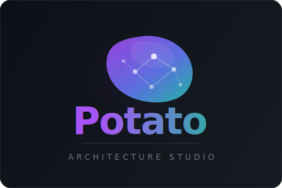

<div align="center">

# 🥔 Potato

### The Cloud Architecture Studio.

**Design AWS / Azure / GCP systems, understand them, price them, and ship a self-contained interactive doc — all in one HTML file.**

*Not a drawing app. Describe your system to any LLM, watch the flow ▶ Play itself, read each service's SLA · limits · pitfalls on hover, total the monthly cost, and ⬇ download the whole workflow as a runbook. No account, no server, no internet.*

[](LICENSE)
[](https://abhisheksingh011.github.io/potato/)
[](#-service-knowledge-base)
[](icons/)
[](#tech-stack)

<br>



<br><br>


</div>

---

## ⚡ Open it now — no install, no account

**👉 [abhisheksingh011.github.io/potato](https://abhisheksingh011.github.io/potato/)**

Just open the link. Nothing to install. Works in any browser.

---

## ✨ Start from a template — fastest path to a real diagram

Click **✨ Templates** in the toolbar (or on the empty canvas) and pick any of the 12 built-in AWS architectures. Every template loads as a fully-wired, editable diagram with real service icons, colour-coded by service family, and a Play Flow narration ready to run.


**What you get out of the box:**

| Click | You see |
|---|---|
| Any node | Properties panel — edit label, sublabel, theme, description |
| Hover a node | Tooltip — SLA · limits · when-to-use · cost · pitfalls |
| ▶ Play | Animated step-by-step walkthrough with architect-level narration |
| 💰 Cost | Per-service monthly cost breakdown at Small / Medium / Large |
| ⬇ Sequence | Download the flow as a plain-text runbook |

Everything is editable after loading — add nodes, redirect arrows, rename services, change themes, add VPC groups. The template is a starting point, not a contract.

**AWS architectures available:**

| Template | What you get |
|---|---|
| **AWS Three-Tier Web App** | Route 53 → CloudFront → WAF → ALB → ECS Fargate (2 AZs) → Aurora + ElastiCache |
| **AWS Serverless API** | API GW → Cognito → Lambda → DynamoDB + SQS async worker + X-Ray |
| **AWS Event-Driven Microservices** | API GW → Lambda services → EventBridge → SQS fan-out → Lambda consumers |
| **AWS Static Site + CDN** | S3 → CloudFront → WAF + ACM + Lambda@Edge → Route 53 |
| **AWS Data Lake & Analytics** | S3 raw → Glue ETL → S3 curated → Athena + Redshift → QuickSight |
| **AWS Container Platform** | CodeCommit → CodePipeline → ECR → ECS Fargate → ALB → Aurora |
| **AWS Hub-and-Spoke Network** | Direct Connect + VPN → Transit Gateway → Prod/Shared/Dev VPCs + Network Firewall |
| **AI Agent Architecture** | Supervisor + sub-agents on Bedrock with memory + tools |
| **ML Training Pipeline** | S3 → SageMaker → Model Registry → real-time + batch inference |
| **RAG Chatbot** | Embedding pipeline + vector DB + Bedrock RAG |
| **Kubernetes App** | Ingress → 2 deployments → Redis + Postgres statefulsets |
| **Multi-Region Active-Active (AWS)** | Two regions live + serving. ECS on Spot, DDB Global Tables, S3 CRR, KMS multi-region keys, ECR replicated. |

---

## 🤖 Generate with AI — from description to production diagram in minutes

No drawing. No drag-and-drop. Just describe what you need, and Potato turns it into a fully-wired, editable cloud architecture — with real AWS icons, cost estimates, and a narrated walkthrough.

---

### Step 1 — Open AI Import

On the empty canvas, click **Generate with AI** (or click **🤖 AI Import** in the toolbar at any time).


The AI Import panel opens — it walks you through three steps.

---

### Step 2 — Copy the LLM prompt

Click the green **📋 Copy LLM prompt** button.


This copies Potato's Principal Cloud Architect prompt to your clipboard — a detailed set of instructions that tells any LLM exactly how to produce a valid Potato diagram: schemas, icon paths, layout rules, colour themes, and playFlow narration style. You only copy it once per session.

---

### Step 3 — Paste the prompt into any LLM and describe your architecture

Open **ChatGPT, Claude, Gemini, Copilot, Mistral, Llama** — any model that returns text.

Paste the copied prompt, then on a new line describe what you want in plain English:

> *"Create a multi-region multi-AZ microservices architecture on AWS with API Gateway, ECS Fargate, Aurora PostgreSQL, DynamoDB Global Tables, ElastiCache Redis, Cognito auth, WAF, Route 53 latency routing, and CloudWatch observability. Two active regions: us-east-1 and eu-west-1."*


The LLM thinks like a principal architect and outputs a complete Potato-format HTML file — nodes, arrows, groups, and a step-by-step narration for every hop in the architecture.

---

### Step 4 — Copy the LLM's output

Select and copy the **entire HTML reply** from the LLM — from `<!DOCTYPE html>` to `</html>`.


The output is raw HTML containing the diagram data as JSON — every node, arrow, VPC group, and a `playFlow` narration array that Potato will animate.

---

### Step 5 — Paste into Potato and click Import

Back in Potato, paste the copied HTML into the text area in the AI Import panel, then click **⬇ Import Diagram**.


Potato validates every node, arrow, and group — auto-correcting any icon paths the LLM guessed wrong — then drops you straight onto the canvas.

---

### Step 6 — Your editable architecture is ready

The full architecture appears on the canvas — real AWS icons, colour-coded by service family, VPC and subnet group boundaries, and orthogonal routed arrows.


Everything is live and editable: click any node to rename it, change its theme, or edit its description. Drag nodes to reposition. Add services from the sidebar. Redirect arrows by dragging their endpoints.

---

### Step 7 — Hit ▶ Play to walk through the architecture

Click **▶ Play** in the toolbar (or press **Space**).


Potato animates the diagram step by step — each arrow lights up in sequence and the narration text appears at the bottom of the screen. It works like a recorded design review: every hop explains what moves, why it moves there, and what architectural principle it satisfies.

---

### Step 8 — Read the narration for each step

As Play runs, each step shows a full architect-level description at the bottom of the screen.


> *"For European users, Amazon Cognito passes the authenticated request to the Amazon API Gateway regional endpoint in eu-west-1 — an identical active-active configuration — so that European traffic never needs to traverse the Atlantic to reach an API entry point, reducing latency..."*

The narration names the trigger, the data, the destination, and the architectural rationale for every connection.

---

### Step 9 — Click 💰 Cost for a monthly estimate

Click **💰 Cost** in the toolbar to open the Cost Estimator.


Switch between **Small (dev/hobby)**, **Medium (small production)**, and **Large (busy production)** workload presets. You get a per-service breakdown with pricing formulas, counts, per-unit costs, and subtotals — all totalled at the bottom.

> *Example: a multi-region multi-AZ architecture with Route 53, CloudFront, WAF, Cognito, API Gateway, ECS ×7, ElastiCache, DynamoDB, RDS ×3, SQS = ~$19,270 / month at Large.*

> ⚠️ Estimates are reference-grade, not authoritative. Always verify with the [official AWS calculator](https://calculator.aws/) before committing.

---

### Step 10 — Edit, reorder, or download the sequence flow

Click **Sequence** in the toolbar to open the **Play Sequence Editor**.


Each step is shown as an editable card — connection name, narration text, reorder handles, and a delete button. You can:

- **Edit** any narration step to match your exact system behaviour
- **Reorder** steps by dragging or using the arrows
- **Add** new steps for branches, error paths, or scheduled jobs
- **⬇ Download Workflow** — exports the entire sequence as a numbered plain-text `.txt` runbook, ready to paste into a PR description, Confluence, or an onboarding wiki

---

> **From a plain-English description to a 30-node, fully-narrated, costed, downloadable architecture — in under 5 minutes.**

---

## 🧠 Why this isn't a diagram tool

A diagram tool stops at the picture. **Potato keeps going** — it's where you *design, understand, price, and document* a cloud system, not just draw one.

> **The picture is the cheap part.** The value is everything Potato wraps around it: the operational knowledge baked into every node, the animated walkthrough, the downloadable runbook, and the monthly cost. A box labelled "Lambda" is a drawing. A Lambda node that tells you its 15-minute ceiling, its cold-start pitfall, its SLA, and its monthly cost — and narrates how a request flows through it — is architecture intelligence.

If you're choosing Potato, you're not choosing it *over* a drawing tool. You're choosing a different category.

---

## 🎯 What you get beyond the diagram

| | |
|---|---|
| 📋 **Architecture knowledge, built in** | Every AWS / Azure / GCP node carries real **SLA, limits, when-to-use guidance, and common pitfalls** — Lambda's 15-min cap, DynamoDB's 400 KB item limit, RDS connection ceilings — one hover away. 52 services documented. |
| 💰 **Monthly cost estimator** | Hover for pricing formulas; click `💰 Cost` to total the whole design at Small / Medium / Large workloads, with a per-service breakdown and a coverage indicator. |
| ▶ **Play-the-flow sequences** | Hit ▶ Play and the architecture **explains itself** step-by-step, with detailed narration that ships inside the file — request lifecycle, failure branches, scheduled jobs, end to end. |
| ⬇ **Downloadable workflow runbook** | Export the play-flow as a numbered **plain-text runbook** (`.txt`) — drop it straight into your docs, a PR description, or an onboarding wiki. The diagram becomes documentation. |
| 🤖 **Plain-English → architecture** | Paste the [Potato prompt](POTATO_LLM_PROMPT.md) into any LLM (ChatGPT / Claude / Gemini / Copilot), describe your system, paste the reply back. Get a real, editable, *knowledge-enriched* design — not just shapes. |
| 📤 **A file that explains itself** | Save → email → recipient double-clicks → interactive viewer in any browser. They hover tooltips, ▶ Play the flow, see the costs. No Potato, no account, no install. |
| 🪣 **1108 official cloud icons** | AWS / Azure / GCP, searchable, drag-and-drop — the real artwork the vendors ship, not stylised reproductions. |

> No account. No telemetry. No subscription. No internet after the initial download.

---

## 🆚 Drawing tools draw. Potato does the other 80%.

| | **Potato** | Diagram tools | Excalidraw | Mermaid | Lucidchart |
|---|---|---|---|---|---|
| **Service knowledge** (SLA · limits · pitfalls) on every node | ✅ | ❌ | ❌ | ❌ | ❌ |
| **Monthly cost estimator** | ✅ | ❌ | ❌ | ❌ | ❌ |
| **Play-the-flow** animated walkthrough with narration | ✅ | ❌ | ❌ | ❌ | ❌ |
| **Downloadable text runbook** from the flow | ✅ | ❌ | ❌ | ❌ | ❌ |
| **LLM-native** — describe it in English, any model | ✅ | ❌ | ❌ | ⚠️ syntax | ❌ |
| **Self-explaining shareable file** (recipient interacts) | ✅ | ❌ | ❌ | ❌ | ❌ |
| 1108 official AWS/Azure/GCP icons built-in | ✅ | ⚠️ download | ❌ | ❌ | ✅ paid |
| Single offline HTML file | ✅ | ❌ | ❌ | ❌ | ❌ |
| Lives in `git diff` next to your code | ✅ HTML | ⚠️ XML | ⚠️ JSON | ✅ MD | ❌ |
| Account / login required | ❌ | ❌ | ❌ | ❌ | ✅ |
| Pricing | **Free** | Free | Free | Free | $$$ |

The first six rows are the product. The drawing is table stakes.

---

## 🚀 Features at a glance

**Diagramming**
- 1108 real AWS / Azure / GCP icons + emoji shapes
- Orthogonal arrows that route around obstacles
- Animated / dashed / dotted arrow styles, 9 colors
- Groups / swimlanes for VPCs, subnets, service boundaries
- Auto-layout (LR / TB), grid snap, fit-to-content
- Touch + pen support on iPad / tablets
- Dark + light themes with visible group borders in both

**AI workflow**
- Inline LLM prompt — one click to copy, no GitHub round-trip
- `🤖 AI Import` validates + sanitizes + rescues icon paths the LLM guessed wrong
- `playFlow` narration ships inside the diagram; ▶ Play walks through it on-screen
- Sequence Editor to reorder, edit, or rewrite the narration — and **⬇ download the whole walkthrough as a text workflow** (`.txt`, numbered steps + narration) for docs, runbooks, or a PR
- Works with **GitHub Copilot Chat** — just reference [`POTATO_LLM_PROMPT.md`](POTATO_LLM_PROMPT.md)

**Knowledge**
- Service KB with **SLA, limits, when-to-use, cost formulas, and pitfalls** for 52 services
- Hover or open the Properties panel — same data, with the as-of date footnote
- Quarterly refresh via one JSON file (`service_kb.json`) + a build script

**Cost Estimator** (`💰 Cost` toolbar button)
- Three workload presets (Small / Medium / Large)
- Per-service breakdown grouped by service type, monthly subtotal each
- Auto-sum total with coverage indicator ("14 of 17 services priced")
- Honest about what's not modelled (egress, NAT gateway, support plans)

**Export & share**
- `💾 Save` → self-contained `.potato.html` (~10–60 KB). Reopens in Potato to edit, double-clicks to view standalone.
- The saved-HTML viewer is **interactive** — hover for tooltips, ▶ Play the flow, switch dark/light theme, no editor required.
- `⬇ Download workflow` (in the Sequence Editor) → exports the ordered steps + narration as a plain-text (`.txt`) file, ready to paste into docs or a PR.

**Import**
- AI Import (LLM HTML or raw JSON)
- Mermaid (`flowchart`, `graph`, `sequenceDiagram`)
- Potato JSON

**Quality of life**
- 60-level undo / redo, copy / paste (preserves arrow connections)
- Multi-select, drag-rect, arrow-key nudge, shift-nudge x10
- Auto-save to localStorage + per-tab crash recovery
- Recent diagrams (last 8) in the Templates modal

---

## ⌨️ Keyboard shortcuts

| Shortcut | Action |
|---|---|
| `Ctrl+S` | Save |
| `Ctrl+Z` / `Ctrl+Y` | Undo / Redo |
| `Ctrl+C` / `Ctrl+V` | Copy / Paste (preserves connections) |
| `Ctrl+A` | Select all |
| `Delete` | Delete selected |
| `Space` | ▶ Play / ⏹ stop the flow animation |
| `S` / `H` / `T` / `G` | Select / Pan / Text / Group tool |
| `+` / `-` / `0` / `F` | Zoom in / out / reset / fit |
| `Arrow keys` | Nudge 1 px (Shift = 10 px) |
| `Escape` | Clear selection · stop playback · close modals |

---

## 🧠 Service Knowledge Base

Every cloud node carries five fields you can edit, refresh quarterly, or extend:

```json
{
  "lambda": {
    "name":      "AWS Lambda",
    "sla":       "99.95% monthly uptime",
    "limits":    "Max execution: 15 min | Memory: 128 MB–10 GB | …",
    "whenToUse": "Best for short-lived, event-driven tasks. Scales to zero.",
    "cost":      "$0.20/M requests + $0.0000166/GB-s. Free tier: 1M req…",
    "pitfalls":  ["VPC cold starts add 1–5 s — keep Lambda outside VPC…", "…"]
  }
}
```

Add new entries to [`service_kb.json`](service_kb.json), run `node _generate_kb.js`, commit. That's the entire workflow.

---

## 💾 Save & share

Saved files are real interactive web pages:

- **Hover any service** → tooltip with SLA, limits, when-to-use, cost (with as-of date), common pitfalls.
- **▶ Play Flow** button → animates the request lifecycle with your narration.
- **Speed dropdown** → 🐢 Slow / Normal / 🐇 Fast.
- **🌙 / ☀️ theme toggle** → flips dark/light, persists per viewer.
- **Space to play, Escape to stop** — same shortcuts as the editor.
- **Drop the file back into Potato** to keep editing — full round-trip.

File size: typically 10–60 KB. No external dependencies. Works fully offline. Email-safe.

> **Save as HTML. Attach to Confluence. Your team gets a fully interactive diagram — hover tooltips, Play flow, cost estimator — without installing anything.**

---

## 🛠 Tech stack

- **Pure vanilla JS** — no React, no Vue, no TypeScript, no build step.
- **HTML5 Canvas** for the minimap.
- **SVG** for the live arrows + saved viewer.
- **CSS Variables** for theming.
- **System fonts** — no Google Fonts, no CDN.
- **localStorage** for autosave; **BroadcastChannel** for cross-tab notifications; **IndexedDB** for FileSystemFileHandle persistence (Chromium).
- **Pointer Events** — works on mouse, trackpad, touch, and pen with identical code paths.

Zero `npm install`, zero compile step, zero runtime dependencies. The whole editor is one ~9000-line HTML file (the bulk is the inlined SVG icon library).

---

## 📁 Project structure

```
potato/
├── index.html                 ← THE entire editor (single file)
├── service_kb.json            ← Quarterly-refresh source of truth for tooltips + cost
├── _generate_kb.js            ← Splices service_kb.json into index.html
├── _generate_components.js    ← Splices the icons/ tree into the COMPONENTS manifest
├── _test_saved_viewer.js      ← Smoke test for the saved-viewer inline script
├── icons/                     ← 1108 SVGs across aws/azure/gcp by category
├── assets/                    ← Screenshots and brand assets
├── POTATO_LLM_PROMPT.md       ← Long-form prompt you can copy into any LLM
├── .github/
│   ├── copilot-instructions.md  ← Auto-loaded by Copilot Chat in this repo
│   └── workflows/check.yml      ← CI: parses inline script, validates JSON, generator drift, viewer smoke test
└── README.md                  ← You are here
```

---

## 🔌 Extend it

**Add custom icons**
1. Drop SVGs into `icons/<provider>/<category>/`.
2. Run `node _generate_components.js`.
3. Reload `index.html`.

**Add cost data for more services**
1. Edit [`service_kb.json`](service_kb.json) — add `costEstimate: { small, medium, large }` to any entry.
2. Run `node _generate_kb.js`.
3. The Cost Estimator picks it up automatically.

---

## 🤝 Contributing

PRs welcome — see [CONTRIBUTING.md](CONTRIBUTING.md).

Especially wanted:
- More services in `service_kb.json` with `costEstimate` fields (39 priced of 52 covered — the 13 unpriced are mostly Azure/GCP/generic shapes)
- Quarterly pricing-refresh PRs
- More templates in the gallery
- Mermaid export (we import; closing the loop is a small lift)
- A GitHub Action that renders `.potato.html` files in PR diffs
- A `potato render diagram.potato.html --png out.png` CLI for CI pipelines

---

## ⚠️ Disclaimers

**Not affiliated with or endorsed by any cloud provider.**
Potato is an independent open-source project. It is not affiliated with, sponsored by, or endorsed by Amazon Web Services, Inc., Microsoft Corporation, or Google LLC.

**Trademark notices.**
Amazon Web Services and the AWS logo are trademarks of Amazon.com, Inc. or its affiliates. Microsoft Azure and the Azure logo are trademarks of Microsoft Corporation. Google Cloud and the Google Cloud logo are trademarks of Google LLC. All cloud service names, icons, and logos appearing in this tool are the property of their respective owners and are used solely to identify those services in technical architecture diagrams. Use of these marks does not imply any relationship with or endorsement by the respective trademark holders. All icon usage is subject to the brand guidelines of the respective provider — see [NOTICE](NOTICE) for details.

**Cost estimates are approximate and may be outdated.**
The built-in cost estimator and the pricing figures in the service knowledge base are editorial summaries of publicly available information, accurate as of the "as of" date shown for each service. Prices change frequently. **Do not use these estimates for budget planning, procurement decisions, or commercial commitments.** Always verify current pricing with the official provider calculators:
- AWS: https://calculator.aws/
- Azure: https://azure.microsoft.com/en-us/pricing/calculator/
- GCP: https://cloud.google.com/products/calculator

**SLA, limits, and service information may be outdated.**
The service knowledge base summarises public documentation as of the stated date and may not reflect the current state of each service. Always verify against official provider documentation before making architectural or operational decisions.

**AI-generated diagrams may contain errors.**
Diagrams produced by LLMs via the AI Import feature are machine-generated and may contain hallucinations, incorrect service configurations, or architectures that do not follow best practices. Review every AI-generated diagram carefully before using it in a production context.

**No professional advice.**
Potato is a diagramming and documentation tool. Nothing it produces constitutes professional engineering, legal, financial, or security advice.

**"As-is" warranty disclaimer.**
Potato is provided under the MIT License "as is", without warranty of any kind. See [LICENSE](LICENSE) for the full disclaimer.

---

## 📄 License

**Code** ([LICENSE](LICENSE)): MIT — free to use, modify, distribute, fork, sell, embed.

**Icons** (`icons/aws/`, `icons/azure/`, `icons/gcp/`): subject to each cloud provider's trademark and brand guidelines. See [NOTICE](NOTICE) for full per-provider attribution.

**Knowledge base** ([`service_kb.json`](service_kb.json)): MIT. Original editorial summaries of public documentation; verify before acting on them.

No telemetry. No tracking. No strings.

---

<div align="center">

**A Cloud Architecture Studio for engineers who want to design, cost, and document systems — not just draw them — without paying $40/seat/month or fighting a SaaS login.**

If Potato saves you time, star the repo ⭐ — it's the only "metric" we collect.

</div>
